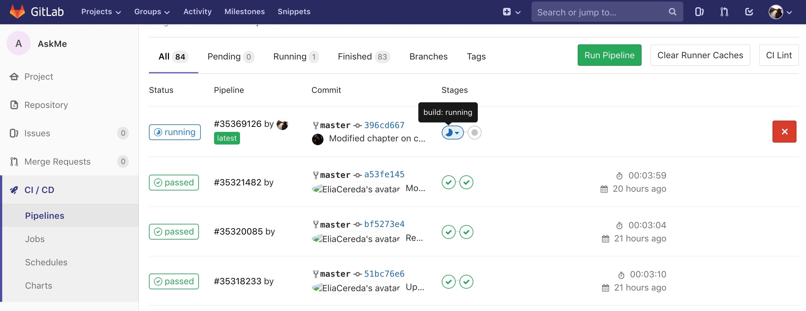
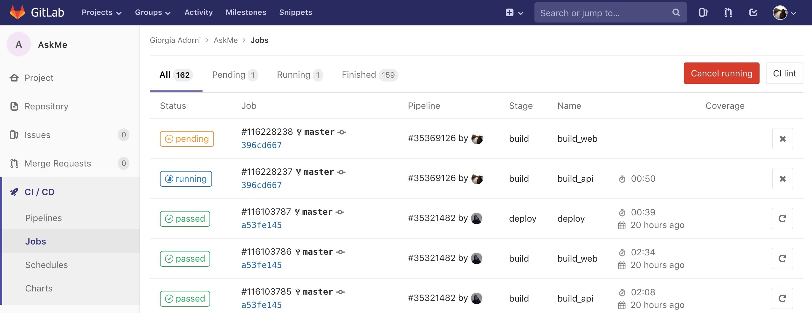
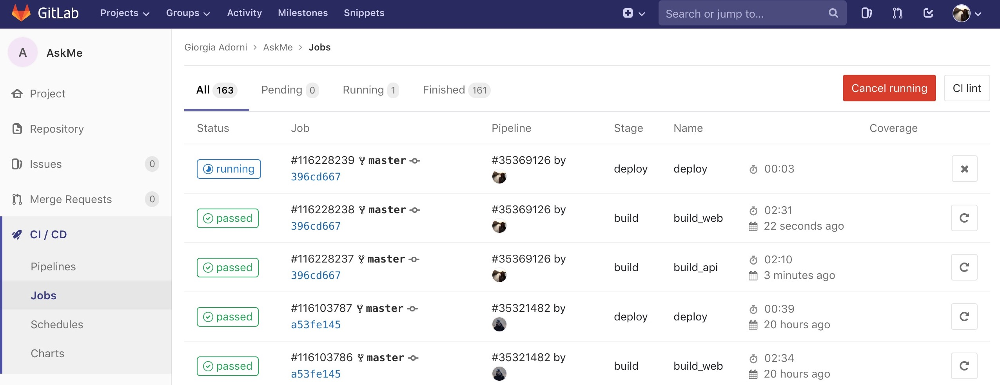
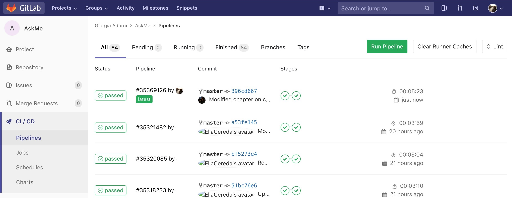
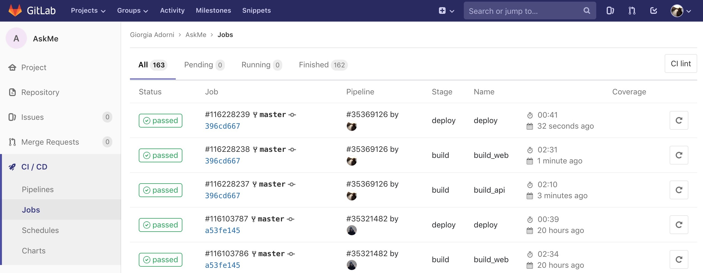

# AskMe

AskMe is a simple Q&A application built on the model of StackOverflow. It
supports asking questions, posting answers and up- or down-voting existing answers.

The source code is available on GitLab at
[https://gitlab.com/GiorgiaAuroraAdorni/askme/](https://gitlab.com/GiorgiaAuroraAdorni/askme/).

#### Contributors
This project has been developed by Giorgia Adorni (806787) and Elia Cereda (807539).

## Architecture
The application has a distributed architecture composed of three main components:
* **web interface:** a client-side web application built with React, through which 
the users interact with the platform.
* **API server:** a web service built using Python and the Flask microframework 
that exposes the REST API used by the frontend.
* **database:** a PostgreSQL instance responsible for persistently storing 
the users' data.

## Containerization
We use Docker to containerize each of the three components. This allows us to 
simplify the setup process of the development environment and to create deployable 
images that contain all dependencies needed by a component. 

Thanks to Docker Compose, developers are able to spin up and debug the various 
containers of the application with a single `docker-compose up` command.
In addition, our `docker-compose.yml` file also starts an instance of pgAdmin to
enable direct access to the database.

We wrote the `Dockerfile`s to take advantage of
[multi-stage builds](https://docs.docker.com/develop/develop-images/multistage-build)
and build arguments to be able to produce two types of images from a single 
configuration: full-featured development images with compilers, debugger support
and live code reloading and slimmed down production images that include just 
the bare minimum required to execute the application.

For example, the web interface requires Node.js and a large number of other
dependencies during development and compilation, while only requiring a static
web server (such as Nginx) in production. Copying only the compiled files to 
production allowed us to create extremely small and efficient images.

## Continuous Integration / Continuous Deployment
We wrote tests for the API server with pytest and for the web interface with the
tools provided by React.

GitLab interface provides a visualization of the pipeline status.   

Using GitLab CI, we have set up a pipeline of Continuous Integration that runs after every commit: 
 * building Docker images

 * running unit tests

 * publishing images to GitLab Container Registry

With Continuous Deployment, commits that successfully pass all stages of the CI pipeline 
are published to the production environment automatically.
This ensures that only functioning builds are released to the customers.

In `.gitlab-ci.yml` file we configure the three stages of our pipeline: build, test, and deploy.
On any push GitLab will look for the `.gitlab-ci.yml` file and start jobs on Runners 
according to the contents of the file, for that commit.

## Provisioning
We originally planned to deploy our application to a shared Kubernetes cluster
offered by [GARR Cloud](https://cloud.garr.it/containers/). Unfortunately, due 
to the multi-tenant nature of the cluster, we didn't have the authorizations to 
perform some actions and we needed assistance from GARR. The most significant 
problem we encountered was provisioning persistent storage for our database in 
Kubernetes.

Since the deadline for this assignment coincided with the week of November 1st, 
we couldn't get an answer in time from GARR and we decided to use another service 
to deploy our application.

We choose to use Google Cloud for two main reasons:
 * They offer a very strong managed service, called 
   [Google Kubernetes Engine](https://cloud.google.com/kubernetes-engine/), that
   allows to run containerized applications without having to manually install a
   Kubernetes cluster. It natively supports auto-scaling for both Pods and Nodes, 
   even across multiple zones in a Google Cloud region for fault tolerance and
   high availability.
 * They use an attractive pricing scheme that includes 300$ of credit for new 
   users and no charge for using GKE beyond the cost of the virtual machines 
   used as Kubernetes Nodes.

## Future developments
